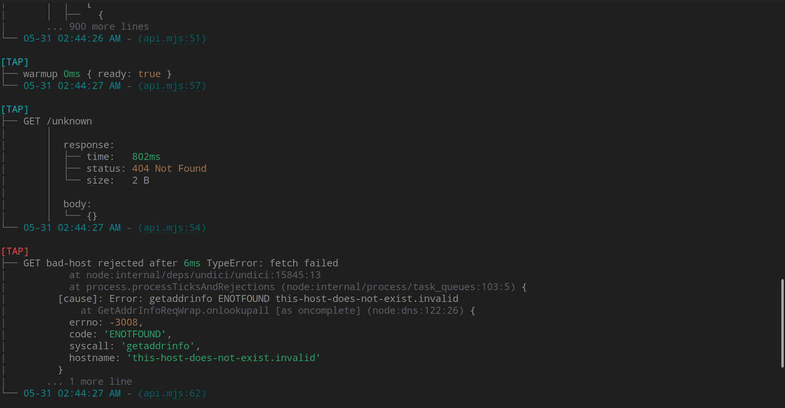

# @meadown/logger

A **development-focused logger** for Node.js and TypeScript. Built to make your
development loop faster and your terminal actually readable.

No dependencies. No config. Import it and you're done.

## Why this exists

I kept writing the same `console.log` wrapper in every project. Every time.
Copy, paste, rename. And I still shipped it to production by accident. Unconsciously I
still spent ten minutes staring at logs trying to figure out which file they
came from.

At some point I just built the thing I always wanted.

One import. No config. No dependencies. It shows you exactly where every log
came from, and it gets out of the way when you ship.

It's not trying to be Winston or Pino. No transports, no log levels, no config files.
Just a better `console.log` for the hours you spend in development. One that
tells you where things came from and disappears when you ship.

> The full story — the problem, the research, every design decision, and
> everything that got cut — is in [`docs/STORY.md`](docs/STORY.md).

## Features

- **Zero dependencies**
- **Development-focused** — built for the dev experience, not production ops
- **Clickable source link** — every log is a clickable link that jumps to the exact file and line it came from
- **Tap logging** — log any value or promise inline; fetch calls also get timing, status, size, and body
- **Color-coded levels** — `[INFO]` cyan, `[WARN]` yellow, `[ERROR]` red
- **Tree layout output** — clean, scannable structure in your terminal
- **Collapsible messages** — cap long output with `logger.maxLines`

## Install

```bash
pnpm add @meadown/logger
# or
npm install @meadown/logger
# or
yarn add @meadown/logger
```

## Using it

Set `NODE_ENV=production` and all output is suppressed. Anything else and
logging is on. No config files, no init call, no options object.

```ts
import logger from "@meadown/logger"

logger("Hello world")
logger("Auth", "user logged in")

logger.warn("This is deprecated")
logger.error("Something went wrong")
```

```text
[INFO]
├── Auth user logged in
└── 05-30 04:00:00 PM - (server.ts:42)
```

### Recommended: single shared import

Rather than importing directly from `@meadown/logger` in every file, create
one shared module in your project and re-export from there. This gives you a
single place to set options like `maxLines` and keeps any future changes to
one file.

```ts
// lib/logger.ts
import logger from "@meadown/logger"

logger.maxLines = 10 // configure once, applies everywhere

export default logger
```

```ts
// anywhere else in your project
import logger from "@/lib/logger"
```

When re-exporting, use a direct re-export, Not a wrapper function. A wrapper
breaks the caller location shown in every log line.

```ts
// GOOD — location stays honest
export { default as logger } from "@meadown/logger"

// BAD — every log points at this file, not the real caller
export const logger = (...args) => log(...args)
```

## API response logging

Drop `tap` into any `await` chain. You get timing, status, size, and the
actual response body. The promise flows through untouched. One line of code.

```ts
const user = await logger.tap(
  fetch("https://api.example.com/users/1"),
  "GET /users/1",
)
// user is the real Response — your code doesn't change at all
```

```text
[TAP]
├── GET /users/1
│
│  response:
│  ├── time:   65ms
│  ├── status: 200 OK
│  └── size:   848 B
│
│  body:
│  ├── id:    1
│  ├── name:  Leanne Graham
│  └── email: Sincere@april.biz
│
└── 05-30 07:54:26 PM - (api.ts:12)
```

You can immediately see: was it successful? How long did it take? What came
back? Without opening DevTools.



### Tap any value

`tap` works on anything, not just fetch. Pass in any value or expression and
get it back exactly as it was. The only thing that happens is a log.

```ts
// numbers, strings, objects — logged and returned as-is
logger.tap(port, "port")
logger.tap(process.env.NODE_ENV, "env")
logger.tap(config, "loaded config")
```

```ts
// async functions — promise flows through, timing logged when it settles
const user = await logger.tap(getUser(), "getUser")
const config = await logger.tap(loadConfig(), "loadConfig")
```

```ts
// inline — no temp variable needed
server.listen(logger.tap(port, "port"))
```

If it's a promise, `tap` logs elapsed time once it settles. If it resolves
to a `Response` (any fetch like call), you also get status and size, same
as the fetch example above.

## Clickable source link

That `(server.ts:42)` is a **clickable link**. Click it and your editor opens the file and jumps straight to that line. Works in VS Code, iTerm2, WezTerm, Kitty, and Windows Terminal. Degrades to plain text everywhere else.

## Color-coded levels

`[INFO]` , `[TAP]` cyan · `[WARN]` yellow · `[ERROR]` red. Timestamp and location tinted teal.
Auto-disabled when output is piped no escape codes in your log files.

## Tree layout output

```text
[INFO]
├── Auth user logged in
└── 05-30 04:00:00 PM - (server.ts:42)
```

Level tag, message, timestamp, and location all in a clean tree. Easy to scan,
even in a busy terminal.

## Collapsible messages

```ts
logger.maxLines = 5 // show 5 lines, then "... N more lines"
logger.maxLines = 0 // default — show everything
```

## NODE_ENV

You shouldn't have to think about whether your logs will leak into production.
This package reads `NODE_ENV` and handles it for you. Set it to `production`
and all output is handled for you. You never have to remember to wrap a log call,
remove a debug line, or grep the codebase before a release.

| `NODE_ENV`                               | Logs?      |
| ---------------------------------------- | ---------- |
| not set, `development`, or anything else | shown      |
| `production`                             | suppressed |

## Security

Zero dependencies, no file or network access, nothing persisted.
See [SECURITY.md](https://github.com/meadown/meadown-logger/blob/main/SECURITY.md) for the full security model.

## License

Architected and developed by [Dewan Mobashirul](https://linkedin.com/in/dewan-meadown)

MIT © [meadown](https://github.com/meadown)
